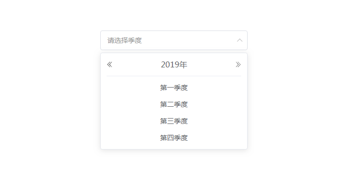

# vue-quarter-select


A basic Vue.js selector that can select quarter.



## Install

```sh
# yarn
yarn add @3scarecrow/vue-quarter-select
```

```sh
#npm
npm install --save @3scarecrow/vue-quarter-select
```

## Documentation

[中文文档](https://3scarecrow.github.io/vue-quarter-select/)

## Usage

```vue
<template>
  <VueQuarterSelect
    v-model="date"
  />
</template>
<script>
import VueQuarterSelect from '@3scarecrow/vue-quarter-select'
export default {
  // ...
  components: {
    VueQuarterSelect
  },
  data() {
    return {
      date: ''
    }
  }
}
</script>
```

## Props

| prop | type | default | description |
| --- | --- | --- | --- |
| value/v-model | String/Array | `[]` | 绑定值 |
| value-format | String | `yyyy-MM-dd` | 绑定值的格式 |
| minDate | String/Date | `undefined` | 小于最小日期的季度将禁用 |
| maxDate | String/Date | `undefined` | 大于最大日期的季度将禁用 |
| format | Function(year,quarter,date) | - | 使用format指定输入框的格式 |
| select-items | Array | - | 自定义下拉选项文本 |
| default-value | Date | - | 默认显示的季度 |

更多Props可查阅 [vue-select-wrapper 的Props](https://laomao800.github.io/vue-select-wrapper/zh/#props)

## Methods

| Methods | Descripion |
| ------- | ---------- |
| clear   | 清空绑定值  |

## Events

| Event | Description | Params |
| ----- | ----------- | ------ |
| clear | 点击清空时触发 | - |

更多Events可查阅 [vue-select-wrapper 的Events](http://localhost:8083/vue-quarter-select/#events)
