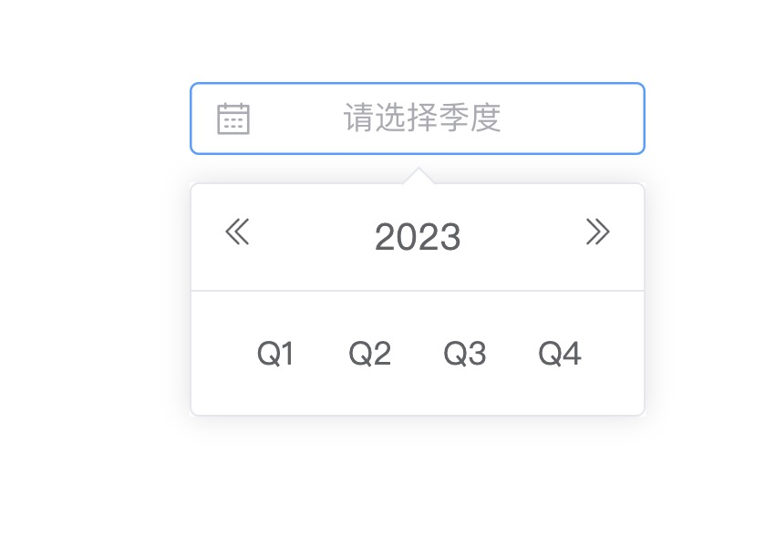

# vue-quarter-select

[](https://github.com/3scarecrow/vue-quarter-select/actions/workflows/ci.yml)
[](https://www.npmjs.com/package/@3scarecrow/vue-quarter-select)

一个基于 Vue2 的季度选择器



## Install

```sh
# yarn
yarn add @3scarecrow/vue-quarter-select
```

```sh
#npm
npm install --save @3scarecrow/vue-quarter-select
```

## Documentation

[vue-quarter-select 2 版本文档](https://3scarecrow.github.io/vue-quarter-select/) |
[vue-quarter-select 1 版本文档](https://3scarecrow.github.io/vue-quarter-select/v1/)

## Usage

```vue
<template>
  <VueQuarterSelect v-model="date" />
</template>
<script>
import VueQuarterSelect from '@3scarecrow/vue-quarter-select'
export default {
  components: {
    VueQuarterSelect
  },
  data() {
    return {
      date: ''
    }
  }
}
</script>
```

## Star History

[](https://star-history.com/#3scarecrow/vue-quarter-select&Date)
